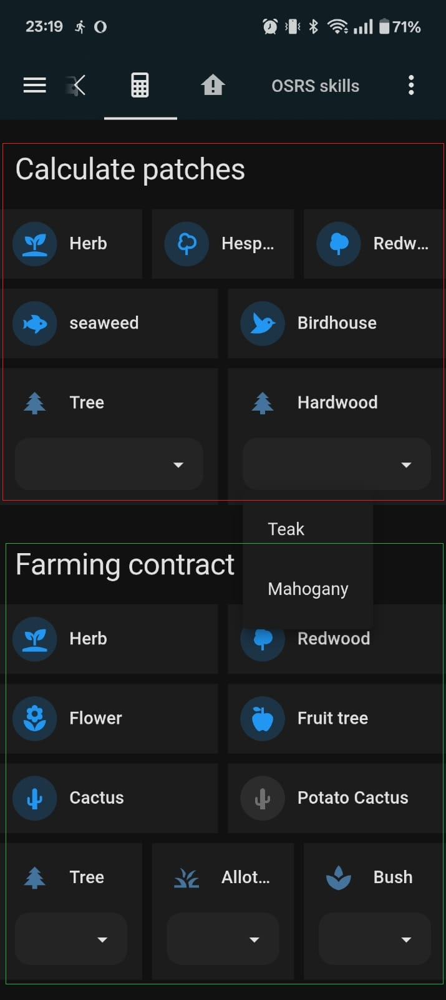

# Calculator for farming patches 

If you like doing farm runs on your phone like I do, this could be a nice addition. It uses buttons and dropdowns for the patches that require it. When clicking one of them it calls a service to update the patch related entity



## HACS used in the example

- piitaya/lovelace-mushroom: https://github.com/piitaya/lovelace-mushroom
- Nerwyn/custom-card-features: https://github.com/Nerwyn/custom-card-features

## Example

This consists of vertical and horizontal stacks to make up the grid. 

I made this by creating a new dashboard of type panel. With the following content:

``` yaml
type: vertical-stack
cards:
  - type: custom:mushroom-title-card
    title: Calculate patches
  - type: horizontal-stack
    cards:
      - type: custom:mushroom-entity-card
        entity: sensor.runelite_%username%_herb_patch
        name: Herb
        icon: mdi:sprout
        tap_action:
          action: call-service
          service: runelite.herb_patch
          data: {}
        secondary_info: none
        primary_info: name
      - type: custom:mushroom-entity-card
        entity: sensor.runelite_%username%_hespori_patch
        name: Hespori
        icon: mdi:tree-outline
        tap_action:
          action: call-service
          service: runelite.hespori_patch
          data: {}
        secondary_info: none
        primary_info: name
      - type: custom:mushroom-entity-card
        entity: sensor.runelite_%username%_redwood_patch
        name: Redwood
        icon: mdi:tree
        tap_action:
          action: call-service
          service: runelite.redwood_patch
          data: {}
        secondary_info: none
        primary_info: name
  - type: horizontal-stack
    cards:
      - type: custom:mushroom-entity-card
        entity: sensor.runelite_%username%_seaweed_patch
        name: seaweed
        icon: mdi:fish
        tap_action:
          action: call-service
          service: runelite.seaweed_patch
          data: {}
        secondary_info: none
        primary_info: name
      - type: custom:mushroom-entity-card
        entity: sensor.runelite_%username%_birdhouses
        name: Birdhouse
        icon: mdi:bird
        tap_action:
          action: call-service
          service: runelite.reset_birdhouses
          data: {}
        secondary_info: none
        primary_info: name
  - type: horizontal-stack
    cards:
      - features:
          - type: custom:service-call
            entries:
              - type: dropdown
                entity_id: sensor.runelite_%username%_tree_patch
                options:
                  - entity_id: sensor.runelite_%username%_tree_patch
                    label: Oak
                    tap_action:
                      action: perform-action
                      perform_action: runelite.tree_patch
                      data:
                        crop_type: oak
                  - entity_id: sensor.runelite_%username%_tree_patch
                    label: Willow
                    tap_action:
                      action: perform-action
                      perform_action: runelite.tree_patch
                      data:
                        crop_type: willow
                  - entity_id: sensor.runelite_%username%_tree_patch
                    label: Maple
                    tap_action:
                      action: perform-action
                      perform_action: runelite.tree_patch
                      data:
                        crop_type: maple
                  - entity_id: sensor.runelite_%username%_tree_patch
                    label: Yew
                    tap_action:
                      action: perform-action
                      perform_action: runelite.tree_patch
                      data:
                        crop_type: yew
                  - entity_id: sensor.runelite_%username%_tree_patch
                    label: Magic
                    tap_action:
                      action: perform-action
                      perform_action: runelite.tree_patch
                      data:
                        crop_type: magic
        type: tile
        name: Tree
        icon: mdi:pine-tree
        entity: sensor.runelite_%username%_tree_patch
        hide_state: true
      - features:
          - type: custom:service-call
            entries:
              - type: dropdown
                entity_id: sensor.runelite_%username%_hardwood_patch
                options:
                  - entity_id: sensor.runelite_%username%_hardwood_patch
                    label: Teak
                    tap_action:
                      action: perform-action
                      perform_action: runelite.hardwood_patch
                      data:
                        crop_type: teak
                  - entity_id: sensor.runelite_%username%_hardwood_patch
                    label: Mahogany
                    tap_action:
                      action: perform-action
                      perform_action: runelite.hardwood_patch
                      data:
                        crop_type: mahogany
        type: tile
        name: Hardwood
        icon: mdi:pine-tree
        entity: sensor.runelite_%username%_hardwood_patch
        hide_state: true
  - type: custom:mushroom-title-card
    title: Farming contract
  - type: horizontal-stack
    cards:
      - type: custom:mushroom-entity-card
        entity: sensor.runelite_%username%_herb_patch
        name: Herb
        icon: mdi:sprout
        tap_action:
          action: call-service
          service: runelite.farming_contract_herb
          data: {}
        secondary_info: none
        primary_info: name
      - type: custom:mushroom-entity-card
        entity: sensor.runelite_%username%_redwood_patch
        name: Redwood
        icon: mdi:tree
        tap_action:
          action: call-service
          service: runelite.farming_contract_redwood
          data: {}
        secondary_info: none
        primary_info: name
  - type: horizontal-stack
    cards:
      - type: custom:mushroom-entity-card
        entity: sensor.runelite_%username%_flower_patch
        name: Flower
        icon: mdi:flower
        tap_action:
          action: call-service
          service: runelite.farming_contract_flower
          data: {}
        secondary_info: none
        primary_info: name
      - type: custom:mushroom-entity-card
        entity: sensor.runelite_%username%_fruit_tree_patch
        name: Fruit tree
        icon: mdi:food-apple
        tap_action:
          action: call-service
          service: runelite.farming_contract_fruit_tree
          data: {}
        secondary_info: none
        primary_info: name
  - type: horizontal-stack
    cards:
      - type: custom:mushroom-entity-card
        entity: sensor.runelite_%username%_cactus_patch
        name: Cactus
        icon: mdi:cactus
        tap_action:
          action: call-service
          service: runelite.farming_contract_cactus
          data: {}
        secondary_info: none
        primary_info: name
      - type: custom:mushroom-entity-card
        entity: sensor.runelite_%username%_potato_cactus_patch
        name: Potato Cactus
        icon: mdi:cactus
        tap_action:
          action: call-service
          service: runelite.farming_contract_potato_cactus
          data: {}
        secondary_info: none
        primary_info: name
  - type: horizontal-stack
    cards:
      - features:
          - type: custom:service-call
            entries:
              - type: dropdown
                entity_id: sensor.runelite_%username%_tree_patch
                options:
                  - entity_id: sensor.runelite_%username%_tree_patch
                    label: Oak
                    tap_action:
                      action: perform-action
                      perform_action: runelite.farming_contract_tree
                      data:
                        crop_type: oak
                  - entity_id: sensor.runelite_%username%_tree_patch
                    label: Willow
                    tap_action:
                      action: perform-action
                      perform_action: runelite.farming_contract_tree
                      data:
                        crop_type: willow
                  - entity_id: sensor.runelite_%username%_tree_patch
                    label: Maple
                    tap_action:
                      action: perform-action
                      perform_action: runelite.farming_contract_tree
                      data:
                        crop_type: maple
                  - entity_id: sensor.runelite_%username%_tree_patch
                    label: Yew
                    tap_action:
                      action: perform-action
                      perform_action: runelite.farming_contract_tree
                      data:
                        crop_type: yew
                  - entity_id: sensor.runelite_%username%_tree_patch
                    label: Magic
                    tap_action:
                      action: perform-action
                      perform_action: runelite.farming_contract_tree
                      data:
                        crop_type: magic
        type: tile
        name: Tree
        icon: mdi:pine-tree
        entity: sensor.runelite_%username%_tree_patch
        hide_state: true
      - features:
          - type: custom:service-call
            entries:
              - type: dropdown
                entity_id: sensor.runelite_%username%_allotment_patch
                options:
                  - entity_id: sensor.runelite_%username%_allotment_patch
                    label: Potato
                    tap_action:
                      action: perform-action
                      perform_action: runelite.farming_contract_allotment
                      data:
                        crop_type: potato
                  - entity_id: sensor.runelite_%username%_allotment_patch
                    label: Onion
                    tap_action:
                      action: perform-action
                      perform_action: runelite.farming_contract_allotment
                      data:
                        crop_type: onion
                  - entity_id: sensor.runelite_%username%_allotment_patch
                    label: Cabbage
                    tap_action:
                      action: perform-action
                      perform_action: runelite.farming_contract_allotment
                      data:
                        crop_type: cabbage
                  - entity_id: sensor.runelite_%username%_allotment_patch
                    label: Tomato
                    tap_action:
                      action: perform-action
                      perform_action: runelite.farming_contract_allotment
                      data:
                        crop_type: tomato
                  - entity_id: sensor.runelite_%username%_allotment_patch
                    label: Sweetcorn
                    tap_action:
                      action: perform-action
                      perform_action: runelite.farming_contract_allotment
                      data:
                        crop_type: sweetcorn
                  - entity_id: sensor.runelite_%username%_allotment_patch
                    label: Strawberry
                    tap_action:
                      action: perform-action
                      perform_action: runelite.farming_contract_allotment
                      data:
                        crop_type: strawberry
                  - entity_id: sensor.runelite_%username%_allotment_patch
                    label: Watermelon
                    tap_action:
                      action: perform-action
                      perform_action: runelite.farming_contract_allotment
                      data:
                        crop_type: watermelon
                  - entity_id: sensor.runelite_%username%_allotment_patch
                    label: Snape Grass
                    tap_action:
                      action: perform-action
                      perform_action: runelite.farming_contract_allotment
                      data:
                        crop_type: snape_grass
        type: tile
        name: Allotment
        icon: mdi:grass
        entity: sensor.runelite_%username%_allotment_patch
        hide_state: true
      - features:
          - type: custom:service-call
            entries:
              - type: dropdown
                entity_id: sensor.runelite_%username%_bush_patch
                options:
                  - entity_id: sensor.runelite_%username%_bush_patch
                    label: Whiteberry
                    tap_action:
                      action: perform-action
                      perform_action: runelite.farming_contract_bush
                      data:
                        crop_type: whiteberry
                  - entity_id: sensor.runelite_%username%_bush_patch
                    label: Poison Ivy
                    tap_action:
                      action: perform-action
                      perform_action: runelite.farming_contract_bush
                      data:
                        crop_type: poison_ivy
                  - entity_id: sensor.runelite_%username%_bush_patch
                    label: Jangerberry
                    tap_action:
                      action: perform-action
                      perform_action: runelite.farming_contract_bush
                      data:
                        crop_type: jangerberry
                  - entity_id: sensor.runelite_%username%_bush_patch
                    label: Redberry
                    tap_action:
                      action: perform-action
                      perform_action: runelite.farming_contract_bush
                      data:
                        crop_type: redberry
                  - entity_id: sensor.runelite_%username%_bush_patch
                    label: Cadavaberry
                    tap_action:
                      action: perform-action
                      perform_action: runelite.farming_contract_bush
                      data:
                        crop_type: cadavaberry
                  - entity_id: sensor.runelite_%username%_bush_patch
                    label: Dwellberry
                    tap_action:
                      action: perform-action
                      perform_action: runelite.farming_contract_bush
                      data:
                        crop_type: dwellberry
        type: tile
        name: Bush
        icon: mdi:spa
        entity: sensor.runelite_%username%_bush_patch
        hide_state: true
```