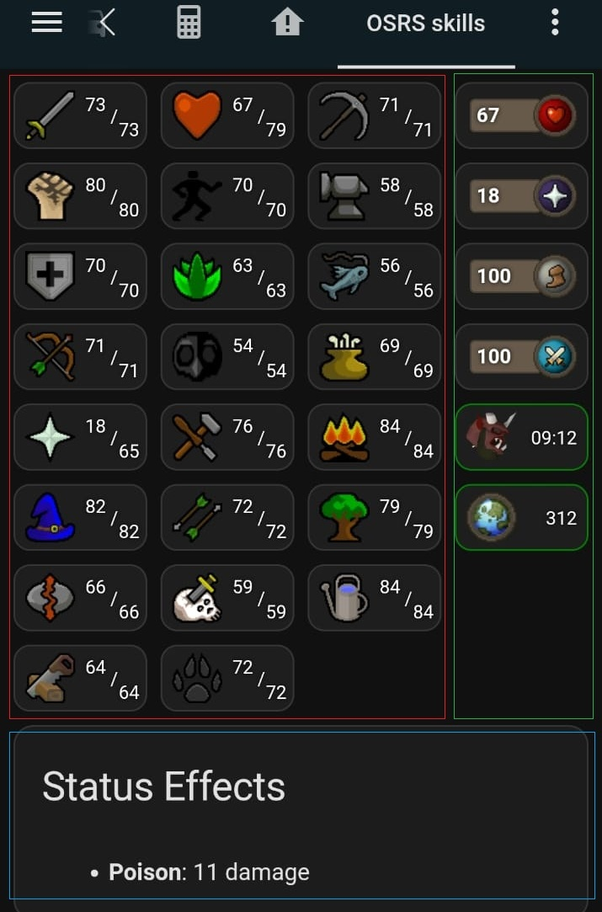

# Current player status: health, prayer, spec, run energy, online/world and aggression timer

This example is the green part of the image below, it works well on desktop as well as mobile



## HACS used in the example

- lovelace button-card: https://github.com/custom-cards/button-card

## Example

Create a manual card with the following yaml content:

```yaml
type: grid
columns: 1
square: false
grid_options:
  columns: 3
  rows: auto
cards:
  - type: custom:button-card
    entity: sensor.runelite_%username%_health
    show_state: false
    show_name: false
    show_icon: false
    styles:
      custom_fields:
        info:
          - display: flex
          - flex-direction: row
          - align-items: center
          - justify-content: space-between
          - width: 100%
          - height: 100%
      card:
        - background-color: "#1e1e1e"
        - border-radius: 10px
        - height: 40px
        - width: 80px
        - padding: 6px 6px
        - position: relative
    custom_fields:
      info: |
        [[[
          const runenergy = entity.attributes.current_health ?? 'N/A';
          return `
            <div style="display: flex; align-items: center; width: 100;">
              <div style="text-align:left;background-color: #685A4B; color: white; font-size: 12px; padding: 2px 3px ; font-weight: bold;  border-radius: 3px; text-shadow: 0px 0px 3px black; width: 35px; border: 1px solid #4C4338">
                ${runenergy}
              </div>
              
            </div>
          `;
        ]]]
  - type: custom:button-card
    entity: sensor.runelite_%username%_prayer
    show_state: false
    show_name: false
    show_icon: false
    styles:
      custom_fields:
        info:
          - display: flex
          - flex-direction: row
          - align-items: center
          - justify-content: space-between
          - width: 100%
          - height: 100%
      card:
        - background-color: "#1e1e1e"
        - border-radius: 10px
        - height: 40px
        - width: 80px
        - padding: 6px 6px
        - position: relative
    custom_fields:
      info: |
        [[[
          const runenergy = entity.attributes.current_prayer ?? 'N/A';
          return `
            <div style="display: flex; align-items: center; width: 100;">
              <div style="text-align:left;background-color: #685A4B; color: white; font-size: 12px; padding: 2px 3px ; font-weight: bold;  border-radius: 3px; text-shadow: 0px 0px 3px black; width: 35px; border: 1px solid #4C4338">
                ${runenergy}
              </div>
              
            </div>
          `;
        ]]]
  - type: custom:button-card
    entity: sensor.runelite_%username%_run_energy
    show_state: false
    show_name: false
    show_icon: false
    styles:
      custom_fields:
        info:
          - display: flex
          - flex-direction: row
          - align-items: center
          - justify-content: space-between
          - width: 100%
          - height: 100%
      card:
        - background-color: "#1e1e1e"
        - border-radius: 10px
        - height: 40px
        - width: 80px
        - padding: 6px 6px
        - position: relative
    custom_fields:
      info: |
        [[[
          const runenergy = entity.attributes.current_run_energy ?? 'N/A';
          return `
            <div style="display: flex; align-items: center; width: 100;">
              <div style="text-align:left;background-color: #685A4B; color: white; font-size: 12px; padding: 2px 3px ; font-weight: bold;  border-radius: 3px; text-shadow: 0px 0px 3px black; width: 35px; border: 1px solid #4C4338">
                ${runenergy}
              </div>
              
            </div>
          `;
        ]]]
  - type: custom:button-card
    entity: sensor.runelite_%username%_special_attack
    show_state: false
    show_name: false
    show_icon: false
    styles:
      custom_fields:
        info:
          - display: flex
          - flex-direction: row
          - align-items: center
          - justify-content: space-between
          - width: 100%
          - height: 100%
      card:
        - background-color: "#1e1e1e"
        - border-radius: 10px
        - height: 40px
        - width: 80px
        - padding: 6px 6px
        - position: relative
    custom_fields:
      info: |
        [[[
          const runenergy = entity.attributes.current_special_attack ?? 'N/A';
          return `
            <div style="display: flex; align-items: center; width: 100;">
              <div style="text-align:left;background-color: #685A4B; color: white; font-size: 12px; padding: 2px 3px ; font-weight: bold;  border-radius: 3px; text-shadow: 0px 0px 3px black; width: 35px; border: 1px solid #4C4338">
                ${runenergy}
              </div>
              
            </div>
          `;
        ]]]
  - type: custom:button-card
    entity: sensor.runelite_%username%_aggression
    show_state: false
    show_name: false
    show_icon: false
    styles:
      custom_fields:
        info:
          - justify-self: end
          - align-self: end
      card:
        - background-image: >-
            [[[ return
            `url('https://oldschool.runescape.wiki/images/thumb/Ensouled_demon_head_detail.png/130px-Ensouled_demon_head_detail.png?4f4ee')`;
            ]]]
        - background-size: 30px 30px
        - background-repeat: no-repeat
        - background-position: 6px center
        - background-color: "#1e1e1e"
        - border-radius: 10px
        - border-color: >-
            [[[ const status = entity.attributes.status ?? 'unknown'; return
            status === 'active' ? 'green' : 'red'; ]]]
        - height: 40px
        - width: 80px
        - padding-left: 10px
        - position: relative
    custom_fields:
      info: |-
        [[[ 
          const totalSeconds = entity.attributes.seconds ?? 0;
          const minutes = Math.floor(totalSeconds / 60).toString().padStart(2, '0');
          const seconds = (totalSeconds % 60).toString().padStart(2, '0');
          const formatted = `${minutes}:${seconds}`;
          return `
            <div style="position: absolute; right: 6px; bottom: 6px; text-align: right; font-size: 11px; line-height: 12px; color: white; text-shadow: 0px 0px 3px black;">
              <div style="position: relative">
                <div style="position: absolute; right: 0px; top: -18px">${formatted}</div>
              </div>
            </div>
          `;
        ]]]
  - type: custom:button-card
    entity: sensor.runelite_%username%_player_status
    show_state: false
    show_name: false
    show_icon: false
    styles:
      custom_fields:
        info:
          - justify-self: end
          - align-self: end
      card:
        - background-image: >-
            [[[ return
            `url('https://oldschool.runescape.wiki/images/World_map_icon.png?6dae2')`;
            ]]]
        - background-size: 30px 30px
        - background-repeat: no-repeat
        - background-position: 6px center
        - background-color: "#1e1e1e"
        - border-radius: 10px
        - border-color: >-
            [[[ const status = entity.attributes.is_online ?? false; return
            status ? 'green' : 'red'; ]]]
        - height: 40px
        - width: 80px
        - padding-left: 10px
        - position: relative
    custom_fields:
      info: |-
        [[[ 
          const world = entity.attributes.world;
          return `
            <div style="position: absolute; right: 6px; bottom: 6px; text-align: right; font-size: 11px; line-height: 12px; color: white; text-shadow: 0px 0px 3px black;">
              <div style="position: relative">
                <div style="position: absolute; right: 0px; top: -18px">${world}</div>
              </div>
            </div>
          `;
        ]]]
```