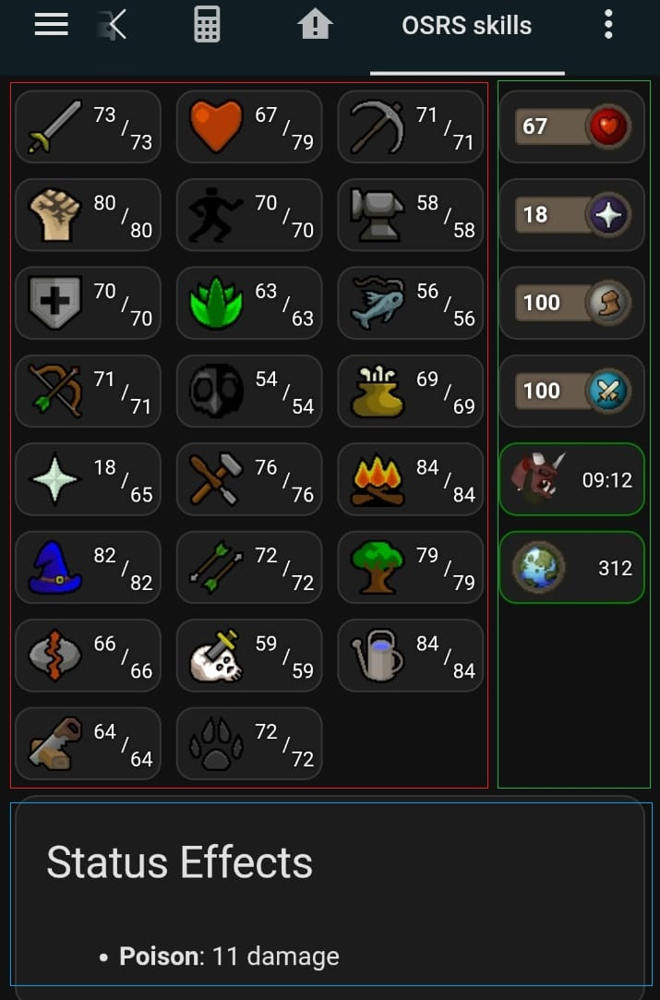

# Skills overview

I recreated the skills screen in OSRS, showing virtual level (boosts) and level with clickable buttons. 
It also uses the skill images from the wiki directly in the dashboard.

This example is the red part of the image below, it works well on desktop as well as mobile



## HACS used in the example

- lovelace button-card: https://github.com/custom-cards/button-card

## Example 

Create a manual card with the following yaml content:

```yaml
type: grid
columns: 3
square: false
cards:
  - type: custom:button-card
    entity: sensor.runelite_%username%_skill_attack
    show_state: false
    show_name: false
    show_icon: false
    styles:
      custom_fields:
        info:
          - justify-self: end
          - align-self: end
      card:
        - background-image: |-
            [[[
              const skillName = entity.attributes.name?.replace(/\s+/g, '_') ?? 'Unknown';
              return `url('https://oldschool.runescape.wiki/images/${skillName}_icon_%28detail%29.png')`;
            ]]]
        - background-size: 30px 30px
        - background-repeat: no-repeat
        - background-position: 6px center
        - background-color: "#1e1e1e"
        - border-radius: 10px
        - height: 40px
        - width: 80px
        - padding-left: 10px
        - position: relative
    custom_fields:
      info: |
        [[[
          const level = entity.attributes.level ?? 'N/A';
          const virtual = entity.attributes.virtual_level ?? '';
          return `
            <div style="position: absolute; right: 6px; bottom: 6px; text-align: right; font-size: 11px; line-height: 12px; color: white; text-shadow: 0px 0px 3px black;">
              <div style="position: relative">
                <div style="position: absolute; left: -30px; top: -25px">${virtual}</div>
                <div style="position: absolute; left: -15px; top: -18px">/</div>
                <div style="position: absolute; left: -10px; top: -10px">${level}</div>
              </div>
            </div>
          `;
        ]]]
  - type: custom:button-card
    entity: sensor.runelite_%username%_skill_hitpoints
    show_state: false
    show_name: false
    show_icon: false
    styles:
      custom_fields:
        info:
          - justify-self: end
          - align-self: end
      card:
        - background-image: |-
            [[[
              const skillName = entity.attributes.name?.replace(/\s+/g, '_') ?? 'Unknown';
              return `url('https://oldschool.runescape.wiki/images/${skillName}_icon_%28detail%29.png')`;
            ]]]
        - background-size: 30px 30px
        - background-repeat: no-repeat
        - background-position: 6px center
        - background-color: "#1e1e1e"
        - border-radius: 10px
        - height: 40px
        - width: 80px
        - padding-left: 10px
        - position: relative
    custom_fields:
      info: |
        [[[
          const level = entity.attributes.level ?? 'N/A';
          const virtual = entity.attributes.virtual_level ?? '';
          return `
            <div style="position: absolute; right: 6px; bottom: 6px; text-align: right; font-size: 11px; line-height: 12px; color: white; text-shadow: 0px 0px 3px black;">
              <div style="position: relative">
                <div style="position: absolute; left: -30px; top: -25px">${virtual}</div>
                <div style="position: absolute; left: -15px; top: -18px">/</div>
                <div style="position: absolute; left: -10px; top: -10px">${level}</div>
              </div>
            </div>
          `;
        ]]]
  - type: custom:button-card
    entity: sensor.runelite_%username%_skill_mining
    show_state: false
    show_name: false
    show_icon: false
    styles:
      custom_fields:
        info:
          - justify-self: end
          - align-self: end
      card:
        - background-image: |-
            [[[
              const skillName = entity.attributes.name?.replace(/\s+/g, '_') ?? 'Unknown';
              return `url('https://oldschool.runescape.wiki/images/${skillName}_icon_%28detail%29.png')`;
            ]]]
        - background-size: 30px 30px
        - background-repeat: no-repeat
        - background-position: 6px center
        - background-color: "#1e1e1e"
        - border-radius: 10px
        - height: 40px
        - width: 80px
        - padding-left: 10px
        - position: relative
    custom_fields:
      info: |
        [[[
          const level = entity.attributes.level ?? 'N/A';
          const virtual = entity.attributes.virtual_level ?? '';
          return `
            <div style="position: absolute; right: 6px; bottom: 6px; text-align: right; font-size: 11px; line-height: 12px; color: white; text-shadow: 0px 0px 3px black;">
              <div style="position: relative">
                <div style="position: absolute; left: -30px; top: -25px">${virtual}</div>
                <div style="position: absolute; left: -15px; top: -18px">/</div>
                <div style="position: absolute; left: -10px; top: -10px">${level}</div>
              </div>
            </div>
          `;
        ]]]
  - type: custom:button-card
    entity: sensor.runelite_%username%_skill_strength
    show_state: false
    show_name: false
    show_icon: false
    styles:
      custom_fields:
        info:
          - justify-self: end
          - align-self: end
      card:
        - background-image: |-
            [[[
              const skillName = entity.attributes.name?.replace(/\s+/g, '_') ?? 'Unknown';
              return `url('https://oldschool.runescape.wiki/images/${skillName}_icon_%28detail%29.png')`;
            ]]]
        - background-size: 30px 30px
        - background-repeat: no-repeat
        - background-position: 6px center
        - background-color: "#1e1e1e"
        - border-radius: 10px
        - height: 40px
        - width: 80px
        - padding-left: 10px
        - position: relative
    custom_fields:
      info: |
        [[[
          const level = entity.attributes.level ?? 'N/A';
          const virtual = entity.attributes.virtual_level ?? '';
          return `
            <div style="position: absolute; right: 6px; bottom: 6px; text-align: right; font-size: 11px; line-height: 12px; color: white; text-shadow: 0px 0px 3px black;">
              <div style="position: relative">
                <div style="position: absolute; left: -30px; top: -25px">${virtual}</div>
                <div style="position: absolute; left: -15px; top: -18px">/</div>
                <div style="position: absolute; left: -10px; top: -10px">${level}</div>
              </div>
            </div>
          `;
        ]]]
  - type: custom:button-card
    entity: sensor.runelite_%username%_skill_agility
    show_state: false
    show_name: false
    show_icon: false
    styles:
      custom_fields:
        info:
          - justify-self: end
          - align-self: end
      card:
        - background-image: |-
            [[[
              const skillName = entity.attributes.name?.replace(/\s+/g, '_') ?? 'Unknown';
              return `url('https://oldschool.runescape.wiki/images/${skillName}_icon_%28detail%29.png')`;
            ]]]
        - background-size: 30px 30px
        - background-repeat: no-repeat
        - background-position: 6px center
        - background-color: "#1e1e1e"
        - border-radius: 10px
        - height: 40px
        - width: 80px
        - padding-left: 10px
        - position: relative
    custom_fields:
      info: |
        [[[
          const level = entity.attributes.level ?? 'N/A';
          const virtual = entity.attributes.virtual_level ?? '';
          return `
            <div style="position: absolute; right: 6px; bottom: 6px; text-align: right; font-size: 11px; line-height: 12px; color: white; text-shadow: 0px 0px 3px black;">
              <div style="position: relative">
                <div style="position: absolute; left: -30px; top: -25px">${virtual}</div>
                <div style="position: absolute; left: -15px; top: -18px">/</div>
                <div style="position: absolute; left: -10px; top: -10px">${level}</div>
              </div>
            </div>
          `;
        ]]]
  - type: custom:button-card
    entity: sensor.runelite_%username%_skill_smithing
    show_state: false
    show_name: false
    show_icon: false
    styles:
      custom_fields:
        info:
          - justify-self: end
          - align-self: end
      card:
        - background-image: |-
            [[[
              const skillName = entity.attributes.name?.replace(/\s+/g, '_') ?? 'Unknown';
              return `url('https://oldschool.runescape.wiki/images/${skillName}_icon_%28detail%29.png')`;
            ]]]
        - background-size: 30px 30px
        - background-repeat: no-repeat
        - background-position: 6px center
        - background-color: "#1e1e1e"
        - border-radius: 10px
        - height: 40px
        - width: 80px
        - padding-left: 10px
        - position: relative
    custom_fields:
      info: |
        [[[
          const level = entity.attributes.level ?? 'N/A';
          const virtual = entity.attributes.virtual_level ?? '';
          return `
            <div style="position: absolute; right: 6px; bottom: 6px; text-align: right; font-size: 11px; line-height: 12px; color: white; text-shadow: 0px 0px 3px black;">
              <div style="position: relative">
                <div style="position: absolute; left: -30px; top: -25px">${virtual}</div>
                <div style="position: absolute; left: -15px; top: -18px">/</div>
                <div style="position: absolute; left: -10px; top: -10px">${level}</div>
              </div>
            </div>
          `;
        ]]]
  - type: custom:button-card
    entity: sensor.runelite_%username%_skill_defence
    show_state: false
    show_name: false
    show_icon: false
    styles:
      custom_fields:
        info:
          - justify-self: end
          - align-self: end
      card:
        - background-image: |-
            [[[
              const skillName = entity.attributes.name?.replace(/\s+/g, '_') ?? 'Unknown';
              return `url('https://oldschool.runescape.wiki/images/${skillName}_icon_%28detail%29.png')`;
            ]]]
        - background-size: 30px 30px
        - background-repeat: no-repeat
        - background-position: 6px center
        - background-color: "#1e1e1e"
        - border-radius: 10px
        - height: 40px
        - width: 80px
        - padding-left: 10px
        - position: relative
    custom_fields:
      info: |
        [[[
          const level = entity.attributes.level ?? 'N/A';
          const virtual = entity.attributes.virtual_level ?? '';
          return `
            <div style="position: absolute; right: 6px; bottom: 6px; text-align: right; font-size: 11px; line-height: 12px; color: white; text-shadow: 0px 0px 3px black;">
              <div style="position: relative">
                <div style="position: absolute; left: -30px; top: -25px">${virtual}</div>
                <div style="position: absolute; left: -15px; top: -18px">/</div>
                <div style="position: absolute; left: -10px; top: -10px">${level}</div>
              </div>
            </div>
          `;
        ]]]
  - type: custom:button-card
    entity: sensor.runelite_%username%_skill_herblore
    show_state: false
    show_name: false
    show_icon: false
    styles:
      custom_fields:
        info:
          - justify-self: end
          - align-self: end
      card:
        - background-image: |-
            [[[
              const skillName = entity.attributes.name?.replace(/\s+/g, '_') ?? 'Unknown';
              return `url('https://oldschool.runescape.wiki/images/${skillName}_icon_%28detail%29.png')`;
            ]]]
        - background-size: 30px 30px
        - background-repeat: no-repeat
        - background-position: 6px center
        - background-color: "#1e1e1e"
        - border-radius: 10px
        - height: 40px
        - width: 80px
        - padding-left: 10px
        - position: relative
    custom_fields:
      info: |
        [[[
          const level = entity.attributes.level ?? 'N/A';
          const virtual = entity.attributes.virtual_level ?? '';
          return `
            <div style="position: absolute; right: 6px; bottom: 6px; text-align: right; font-size: 11px; line-height: 12px; color: white; text-shadow: 0px 0px 3px black;">
              <div style="position: relative">
                <div style="position: absolute; left: -30px; top: -25px">${virtual}</div>
                <div style="position: absolute; left: -15px; top: -18px">/</div>
                <div style="position: absolute; left: -10px; top: -10px">${level}</div>
              </div>
            </div>
          `;
        ]]]
  - type: custom:button-card
    entity: sensor.runelite_%username%_skill_fishing
    show_state: false
    show_name: false
    show_icon: false
    styles:
      custom_fields:
        info:
          - justify-self: end
          - align-self: end
      card:
        - background-image: |-
            [[[
              const skillName = entity.attributes.name?.replace(/\s+/g, '_') ?? 'Unknown';
              return `url('https://oldschool.runescape.wiki/images/${skillName}_icon_%28detail%29.png')`;
            ]]]
        - background-size: 30px 30px
        - background-repeat: no-repeat
        - background-position: 6px center
        - background-color: "#1e1e1e"
        - border-radius: 10px
        - height: 40px
        - width: 80px
        - padding-left: 10px
        - position: relative
    custom_fields:
      info: |
        [[[
          const level = entity.attributes.level ?? 'N/A';
          const virtual = entity.attributes.virtual_level ?? '';
          return `
            <div style="position: absolute; right: 6px; bottom: 6px; text-align: right; font-size: 11px; line-height: 12px; color: white; text-shadow: 0px 0px 3px black;">
              <div style="position: relative">
                <div style="position: absolute; left: -30px; top: -25px">${virtual}</div>
                <div style="position: absolute; left: -15px; top: -18px">/</div>
                <div style="position: absolute; left: -10px; top: -10px">${level}</div>
              </div>
            </div>
          `;
        ]]]
  - type: custom:button-card
    entity: sensor.runelite_%username%_skill_ranged
    show_state: false
    show_name: false
    show_icon: false
    styles:
      custom_fields:
        info:
          - justify-self: end
          - align-self: end
      card:
        - background-image: |-
            [[[
              const skillName = entity.attributes.name?.replace(/\s+/g, '_') ?? 'Unknown';
              return `url('https://oldschool.runescape.wiki/images/${skillName}_icon_%28detail%29.png')`;
            ]]]
        - background-size: 30px 30px
        - background-repeat: no-repeat
        - background-position: 6px center
        - background-color: "#1e1e1e"
        - border-radius: 10px
        - height: 40px
        - width: 80px
        - padding-left: 10px
        - position: relative
    custom_fields:
      info: |
        [[[
          const level = entity.attributes.level ?? 'N/A';
          const virtual = entity.attributes.virtual_level ?? '';
          return `
            <div style="position: absolute; right: 6px; bottom: 6px; text-align: right; font-size: 11px; line-height: 12px; color: white; text-shadow: 0px 0px 3px black;">
              <div style="position: relative">
                <div style="position: absolute; left: -30px; top: -25px">${virtual}</div>
                <div style="position: absolute; left: -15px; top: -18px">/</div>
                <div style="position: absolute; left: -10px; top: -10px">${level}</div>
              </div>
            </div>
          `;
        ]]]
  - type: custom:button-card
    entity: sensor.runelite_%username%_skill_thieving
    show_state: false
    show_name: false
    show_icon: false
    styles:
      custom_fields:
        info:
          - justify-self: end
          - align-self: end
      card:
        - background-image: |-
            [[[
              const skillName = entity.attributes.name?.replace(/\s+/g, '_') ?? 'Unknown';
              return `url('https://oldschool.runescape.wiki/images/${skillName}_icon_%28detail%29.png')`;
            ]]]
        - background-size: 30px 30px
        - background-repeat: no-repeat
        - background-position: 6px center
        - background-color: "#1e1e1e"
        - border-radius: 10px
        - height: 40px
        - width: 80px
        - padding-left: 10px
        - position: relative
    custom_fields:
      info: |
        [[[
          const level = entity.attributes.level ?? 'N/A';
          const virtual = entity.attributes.virtual_level ?? '';
          return `
            <div style="position: absolute; right: 6px; bottom: 6px; text-align: right; font-size: 11px; line-height: 12px; color: white; text-shadow: 0px 0px 3px black;">
              <div style="position: relative">
                <div style="position: absolute; left: -30px; top: -25px">${virtual}</div>
                <div style="position: absolute; left: -15px; top: -18px">/</div>
                <div style="position: absolute; left: -10px; top: -10px">${level}</div>
              </div>
            </div>
          `;
        ]]]
  - type: custom:button-card
    entity: sensor.runelite_%username%_skill_cooking
    show_state: false
    show_name: false
    show_icon: false
    styles:
      custom_fields:
        info:
          - justify-self: end
          - align-self: end
      card:
        - background-image: |-
            [[[
              const skillName = entity.attributes.name?.replace(/\s+/g, '_') ?? 'Unknown';
              return `url('https://oldschool.runescape.wiki/images/${skillName}_icon_%28detail%29.png')`;
            ]]]
        - background-size: 30px 30px
        - background-repeat: no-repeat
        - background-position: 6px center
        - background-color: "#1e1e1e"
        - border-radius: 10px
        - height: 40px
        - width: 80px
        - padding-left: 10px
        - position: relative
    custom_fields:
      info: |
        [[[
          const level = entity.attributes.level ?? 'N/A';
          const virtual = entity.attributes.virtual_level ?? '';
          return `
            <div style="position: absolute; right: 6px; bottom: 6px; text-align: right; font-size: 11px; line-height: 12px; color: white; text-shadow: 0px 0px 3px black;">
              <div style="position: relative">
                <div style="position: absolute; left: -30px; top: -25px">${virtual}</div>
                <div style="position: absolute; left: -15px; top: -18px">/</div>
                <div style="position: absolute; left: -10px; top: -10px">${level}</div>
              </div>
            </div>
          `;
        ]]]
  - type: custom:button-card
    entity: sensor.runelite_%username%_skill_prayer
    show_state: false
    show_name: false
    show_icon: false
    styles:
      custom_fields:
        info:
          - justify-self: end
          - align-self: end
      card:
        - background-image: |-
            [[[
              const skillName = entity.attributes.name?.replace(/\s+/g, '_') ?? 'Unknown';
              return `url('https://oldschool.runescape.wiki/images/${skillName}_icon_%28detail%29.png')`;
            ]]]
        - background-size: 30px 30px
        - background-repeat: no-repeat
        - background-position: 6px center
        - background-color: "#1e1e1e"
        - border-radius: 10px
        - height: 40px
        - width: 80px
        - padding-left: 10px
        - position: relative
    custom_fields:
      info: |
        [[[
          const level = entity.attributes.level ?? 'N/A';
          const virtual = entity.attributes.virtual_level ?? '';
          return `
            <div style="position: absolute; right: 6px; bottom: 6px; text-align: right; font-size: 11px; line-height: 12px; color: white; text-shadow: 0px 0px 3px black;">
              <div style="position: relative">
                <div style="position: absolute; left: -30px; top: -25px">${virtual}</div>
                <div style="position: absolute; left: -15px; top: -18px">/</div>
                <div style="position: absolute; left: -10px; top: -10px">${level}</div>
              </div>
            </div>
          `;
        ]]]
  - type: custom:button-card
    entity: sensor.runelite_%username%_skill_crafting
    show_state: false
    show_name: false
    show_icon: false
    styles:
      custom_fields:
        info:
          - justify-self: end
          - align-self: end
      card:
        - background-image: |-
            [[[
              const skillName = entity.attributes.name?.replace(/\s+/g, '_') ?? 'Unknown';
              return `url('https://oldschool.runescape.wiki/images/${skillName}_icon_%28detail%29.png')`;
            ]]]
        - background-size: 30px 30px
        - background-repeat: no-repeat
        - background-position: 6px center
        - background-color: "#1e1e1e"
        - border-radius: 10px
        - height: 40px
        - width: 80px
        - padding-left: 10px
        - position: relative
    custom_fields:
      info: |
        [[[
          const level = entity.attributes.level ?? 'N/A';
          const virtual = entity.attributes.virtual_level ?? '';
          return `
            <div style="position: absolute; right: 6px; bottom: 6px; text-align: right; font-size: 11px; line-height: 12px; color: white; text-shadow: 0px 0px 3px black;">
              <div style="position: relative">
                <div style="position: absolute; left: -30px; top: -25px">${virtual}</div>
                <div style="position: absolute; left: -15px; top: -18px">/</div>
                <div style="position: absolute; left: -10px; top: -10px">${level}</div>
              </div>
            </div>
          `;
        ]]]
  - type: custom:button-card
    entity: sensor.runelite_%username%_skill_firemaking
    show_state: false
    show_name: false
    show_icon: false
    styles:
      custom_fields:
        info:
          - justify-self: end
          - align-self: end
      card:
        - background-image: |-
            [[[
              const skillName = entity.attributes.name?.replace(/\s+/g, '_') ?? 'Unknown';
              return `url('https://oldschool.runescape.wiki/images/${skillName}_icon_%28detail%29.png')`;
            ]]]
        - background-size: 30px 30px
        - background-repeat: no-repeat
        - background-position: 6px center
        - background-color: "#1e1e1e"
        - border-radius: 10px
        - height: 40px
        - width: 80px
        - padding-left: 10px
        - position: relative
    custom_fields:
      info: |
        [[[
          const level = entity.attributes.level ?? 'N/A';
          const virtual = entity.attributes.virtual_level ?? '';
          return `
            <div style="position: absolute; right: 6px; bottom: 6px; text-align: right; font-size: 11px; line-height: 12px; color: white; text-shadow: 0px 0px 3px black;">
              <div style="position: relative">
                <div style="position: absolute; left: -30px; top: -25px">${virtual}</div>
                <div style="position: absolute; left: -15px; top: -18px">/</div>
                <div style="position: absolute; left: -10px; top: -10px">${level}</div>
              </div>
            </div>
          `;
        ]]]
  - type: custom:button-card
    entity: sensor.runelite_%username%_skill_magic
    show_state: false
    show_name: false
    show_icon: false
    styles:
      custom_fields:
        info:
          - justify-self: end
          - align-self: end
      card:
        - background-image: |-
            [[[
              const skillName = entity.attributes.name?.replace(/\s+/g, '_') ?? 'Unknown';
              return `url('https://oldschool.runescape.wiki/images/${skillName}_icon_%28detail%29.png')`;
            ]]]
        - background-size: 30px 30px
        - background-repeat: no-repeat
        - background-position: 6px center
        - background-color: "#1e1e1e"
        - border-radius: 10px
        - height: 40px
        - width: 80px
        - padding-left: 10px
        - position: relative
    custom_fields:
      info: |
        [[[
          const level = entity.attributes.level ?? 'N/A';
          const virtual = entity.attributes.virtual_level ?? '';
          return `
            <div style="position: absolute; right: 6px; bottom: 6px; text-align: right; font-size: 11px; line-height: 12px; color: white; text-shadow: 0px 0px 3px black;">
              <div style="position: relative">
                <div style="position: absolute; left: -30px; top: -25px">${virtual}</div>
                <div style="position: absolute; left: -15px; top: -18px">/</div>
                <div style="position: absolute; left: -10px; top: -10px">${level}</div>
              </div>
            </div>
          `;
        ]]]
  - type: custom:button-card
    entity: sensor.runelite_%username%_skill_fletching
    show_state: false
    show_name: false
    show_icon: false
    styles:
      custom_fields:
        info:
          - justify-self: end
          - align-self: end
      card:
        - background-image: |-
            [[[
              const skillName = entity.attributes.name?.replace(/\s+/g, '_') ?? 'Unknown';
              return `url('https://oldschool.runescape.wiki/images/${skillName}_icon_%28detail%29.png')`;
            ]]]
        - background-size: 30px 30px
        - background-repeat: no-repeat
        - background-position: 6px center
        - background-color: "#1e1e1e"
        - border-radius: 10px
        - height: 40px
        - width: 80px
        - padding-left: 10px
        - position: relative
    custom_fields:
      info: |
        [[[
          const level = entity.attributes.level ?? 'N/A';
          const virtual = entity.attributes.virtual_level ?? '';
          return `
            <div style="position: absolute; right: 6px; bottom: 6px; text-align: right; font-size: 11px; line-height: 12px; color: white; text-shadow: 0px 0px 3px black;">
              <div style="position: relative">
                <div style="position: absolute; left: -30px; top: -25px">${virtual}</div>
                <div style="position: absolute; left: -15px; top: -18px">/</div>
                <div style="position: absolute; left: -10px; top: -10px">${level}</div>
              </div>
            </div>
          `;
        ]]]
  - type: custom:button-card
    entity: sensor.runelite_%username%_skill_woodcutting
    show_state: false
    show_name: false
    show_icon: false
    styles:
      custom_fields:
        info:
          - justify-self: end
          - align-self: end
      card:
        - background-image: |-
            [[[
              const skillName = entity.attributes.name?.replace(/\s+/g, '_') ?? 'Unknown';
              return `url('https://oldschool.runescape.wiki/images/${skillName}_icon_%28detail%29.png')`;
            ]]]
        - background-size: 30px 30px
        - background-repeat: no-repeat
        - background-position: 6px center
        - background-color: "#1e1e1e"
        - border-radius: 10px
        - height: 40px
        - width: 80px
        - padding-left: 10px
        - position: relative
    custom_fields:
      info: |
        [[[
          const level = entity.attributes.level ?? 'N/A';
          const virtual = entity.attributes.virtual_level ?? '';
          return `
            <div style="position: absolute; right: 6px; bottom: 6px; text-align: right; font-size: 11px; line-height: 12px; color: white; text-shadow: 0px 0px 3px black;">
              <div style="position: relative">
                <div style="position: absolute; left: -30px; top: -25px">${virtual}</div>
                <div style="position: absolute; left: -15px; top: -18px">/</div>
                <div style="position: absolute; left: -10px; top: -10px">${level}</div>
              </div>
            </div>
          `;
        ]]]
  - type: custom:button-card
    entity: sensor.runelite_%username%_skill_runecraft
    show_state: false
    show_name: false
    show_icon: false
    styles:
      custom_fields:
        info:
          - justify-self: end
          - align-self: end
      card:
        - background-image: |-
            [[[
              const skillName = entity.attributes.name?.replace(/\s+/g, '_') ?? 'Unknown';
              return `url('https://oldschool.runescape.wiki/images/${skillName}_icon_%28detail%29.png')`;
            ]]]
        - background-size: 30px 30px
        - background-repeat: no-repeat
        - background-position: 6px center
        - background-color: "#1e1e1e"
        - border-radius: 10px
        - height: 40px
        - width: 80px
        - padding-left: 10px
        - position: relative
    custom_fields:
      info: |
        [[[
          const level = entity.attributes.level ?? 'N/A';
          const virtual = entity.attributes.virtual_level ?? '';
          return `
            <div style="position: absolute; right: 6px; bottom: 6px; text-align: right; font-size: 11px; line-height: 12px; color: white; text-shadow: 0px 0px 3px black;">
              <div style="position: relative">
                <div style="position: absolute; left: -30px; top: -25px">${virtual}</div>
                <div style="position: absolute; left: -15px; top: -18px">/</div>
                <div style="position: absolute; left: -10px; top: -10px">${level}</div>
              </div>
            </div>
          `;
        ]]]
  - type: custom:button-card
    entity: sensor.runelite_%username%_skill_slayer
    show_state: false
    show_name: false
    show_icon: false
    styles:
      custom_fields:
        info:
          - justify-self: end
          - align-self: end
      card:
        - background-image: |-
            [[[
              const skillName = entity.attributes.name?.replace(/\s+/g, '_') ?? 'Unknown';
              return `url('https://oldschool.runescape.wiki/images/${skillName}_icon_%28detail%29.png')`;
            ]]]
        - background-size: 30px 30px
        - background-repeat: no-repeat
        - background-position: 6px center
        - background-color: "#1e1e1e"
        - border-radius: 10px
        - height: 40px
        - width: 80px
        - padding-left: 10px
        - position: relative
    custom_fields:
      info: |
        [[[
          const level = entity.attributes.level ?? 'N/A';
          const virtual = entity.attributes.virtual_level ?? '';
          return `
            <div style="position: absolute; right: 6px; bottom: 6px; text-align: right; font-size: 11px; line-height: 12px; color: white; text-shadow: 0px 0px 3px black;">
              <div style="position: relative">
                <div style="position: absolute; left: -30px; top: -25px">${virtual}</div>
                <div style="position: absolute; left: -15px; top: -18px">/</div>
                <div style="position: absolute; left: -10px; top: -10px">${level}</div>
              </div>
            </div>
          `;
        ]]]
  - type: custom:button-card
    entity: sensor.runelite_%username%_skill_farming
    show_state: false
    show_name: false
    show_icon: false
    styles:
      custom_fields:
        info:
          - justify-self: end
          - align-self: end
      card:
        - background-image: |-
            [[[
              const skillName = entity.attributes.name?.replace(/\s+/g, '_') ?? 'Unknown';
              return `url('https://oldschool.runescape.wiki/images/${skillName}_icon_%28detail%29.png')`;
            ]]]
        - background-size: 30px 30px
        - background-repeat: no-repeat
        - background-position: 6px center
        - background-color: "#1e1e1e"
        - border-radius: 10px
        - height: 40px
        - width: 80px
        - padding-left: 10px
        - position: relative
    custom_fields:
      info: |
        [[[
          const level = entity.attributes.level ?? 'N/A';
          const virtual = entity.attributes.virtual_level ?? '';
          return `
            <div style="position: absolute; right: 6px; bottom: 6px; text-align: right; font-size: 11px; line-height: 12px; color: white; text-shadow: 0px 0px 3px black;">
              <div style="position: relative">
                <div style="position: absolute; left: -30px; top: -25px">${virtual}</div>
                <div style="position: absolute; left: -15px; top: -18px">/</div>
                <div style="position: absolute; left: -10px; top: -10px">${level}</div>
              </div>
            </div>
          `;
        ]]]
  - type: custom:button-card
    entity: sensor.runelite_%username%_skill_construction
    show_state: false
    show_name: false
    show_icon: false
    styles:
      custom_fields:
        info:
          - justify-self: end
          - align-self: end
      card:
        - background-image: |-
            [[[
              const skillName = entity.attributes.name?.replace(/\s+/g, '_') ?? 'Unknown';
              return `url('https://oldschool.runescape.wiki/images/${skillName}_icon_%28detail%29.png')`;
            ]]]
        - background-size: 30px 30px
        - background-repeat: no-repeat
        - background-position: 6px center
        - background-color: "#1e1e1e"
        - border-radius: 10px
        - height: 40px
        - width: 80px
        - padding-left: 10px
        - position: relative
    custom_fields:
      info: |
        [[[
          const level = entity.attributes.level ?? 'N/A';
          const virtual = entity.attributes.virtual_level ?? '';
          return `
            <div style="position: absolute; right: 6px; bottom: 6px; text-align: right; font-size: 11px; line-height: 12px; color: white; text-shadow: 0px 0px 3px black;">
              <div style="position: relative">
                <div style="position: absolute; left: -30px; top: -25px">${virtual}</div>
                <div style="position: absolute; left: -15px; top: -18px">/</div>
                <div style="position: absolute; left: -10px; top: -10px">${level}</div>
              </div>
            </div>
          `;
        ]]]
  - type: custom:button-card
    entity: sensor.runelite_%username%_skill_hunter
    show_state: false
    show_name: false
    show_icon: false
    styles:
      custom_fields:
        info:
          - justify-self: end
          - align-self: end
      card:
        - background-image: |-
            [[[
              const skillName = entity.attributes.name?.replace(/\s+/g, '_') ?? 'Unknown';
              return `url('https://oldschool.runescape.wiki/images/${skillName}_icon_%28detail%29.png')`;
            ]]]
        - background-size: 30px 30px
        - background-repeat: no-repeat
        - background-position: 6px center
        - background-color: "#1e1e1e"
        - border-radius: 10px
        - height: 40px
        - width: 80px
        - padding-left: 10px
        - position: relative
    custom_fields:
      info: |
        [[[
          const level = entity.attributes.level ?? 'N/A';
          const virtual = entity.attributes.virtual_level ?? '';
          return `
            <div style="position: absolute; right: 6px; bottom: 6px; text-align: right; font-size: 11px; line-height: 12px; color: white; text-shadow: 0px 0px 3px black;">
              <div style="position: relative">
                <div style="position: absolute; left: -30px; top: -25px">${virtual}</div>
                <div style="position: absolute; left: -15px; top: -18px">/</div>
                <div style="position: absolute; left: -10px; top: -10px">${level}</div>
              </div>
            </div>
          `;
        ]]]
```
